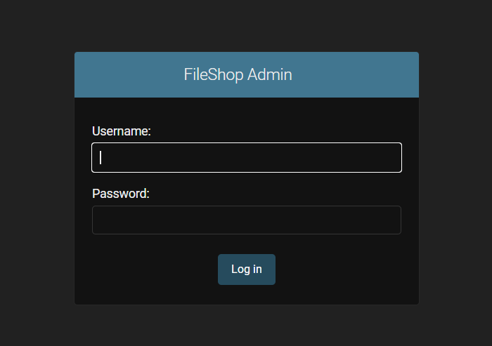
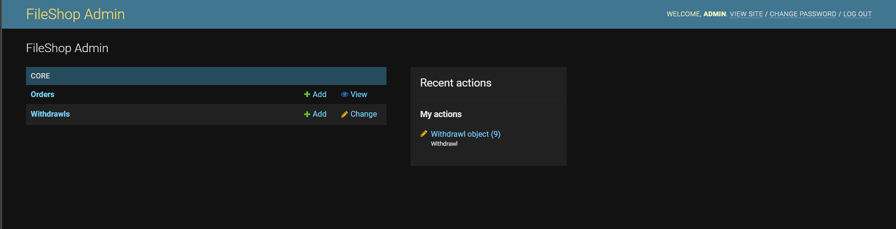
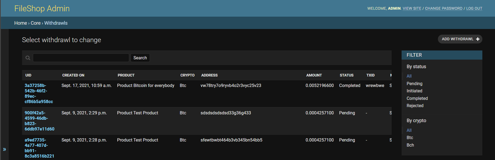
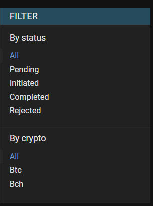
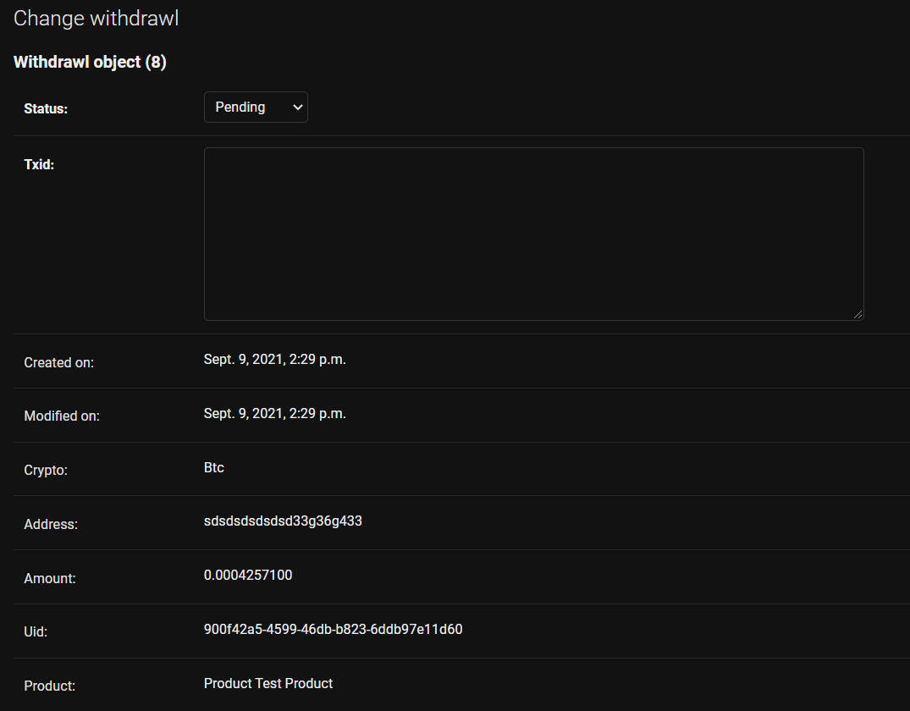

# Admin - Withdrawls

As an admin of the site, you can process withdrawl requests via Admin Panel.

## Pre-requisites

In order to login to admin, you must have atleast one superuser account in the website. If you've not created on you can follow the directions in `Creating Super User` Section to create one.

## Accessing the Admin

To access the Admin panel, visit `<your_backend_url>/admin` e.g. https://fileshop.online/admin

You'll be presented with a login screen. You can login with any super user in the panel.

Once you login, you'll reach the Admin Panel. At Admin Panel you'll be able to see Orders and Withdrawls.

Editing Orders is restricted by default. Withdrawls can however be editied restrictively.

## Managing the withdrawls

To manage withdrawls, visit `/admin/core/withdrawl/` or just click on `Withdrawls` in above dashboard.

Using the status filter on the right you can filter all unprocessed orders or on the basis of Crypto.

### Processing Withdrawls

Processing Withdrawls is a manual process. Any user can submit the request for Withdrawl from the seller dashboard. You can view the withdrawl requests in the Admin Panel and manually process them. Once done, you can update the status using steps below.

To process withdrawl, click on any unprocesses Withdrawl UID to open the details. On the page, you can edit the Status of Withdrawl to Rejected, Pending, Initiated or Completed and enter Transaction ID (txid) after processing the withdrawl.

That's all!